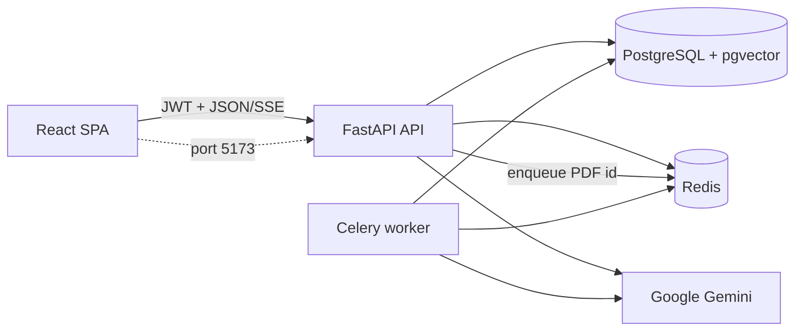
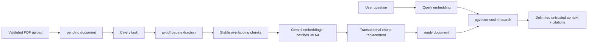
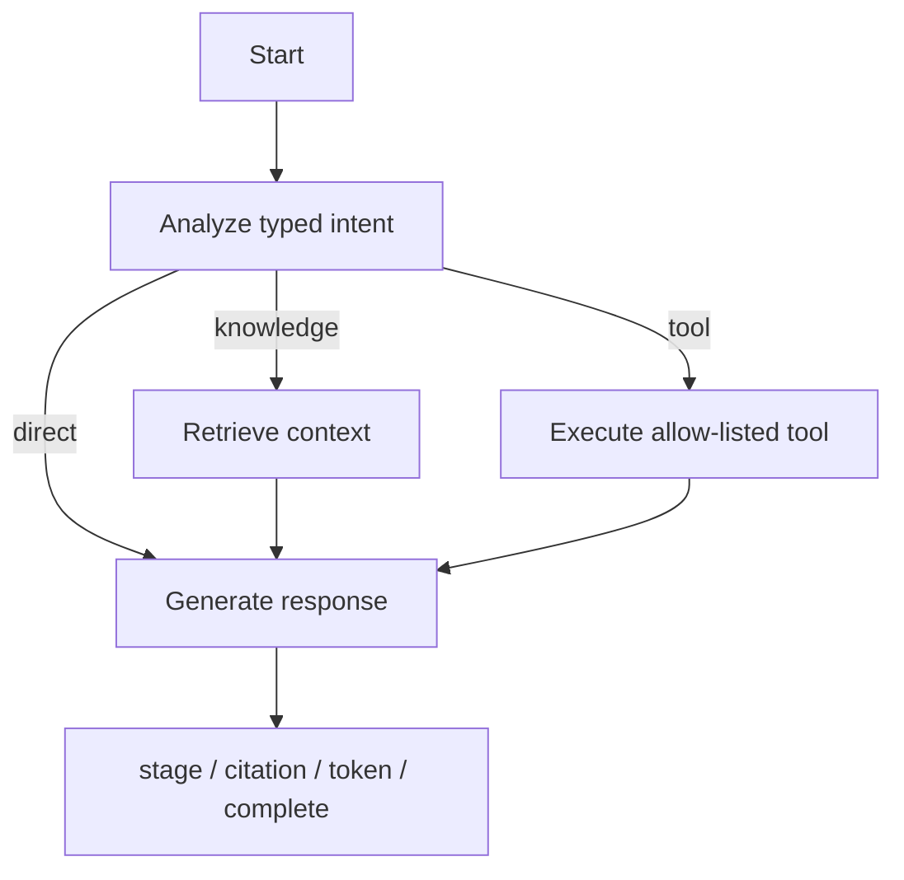
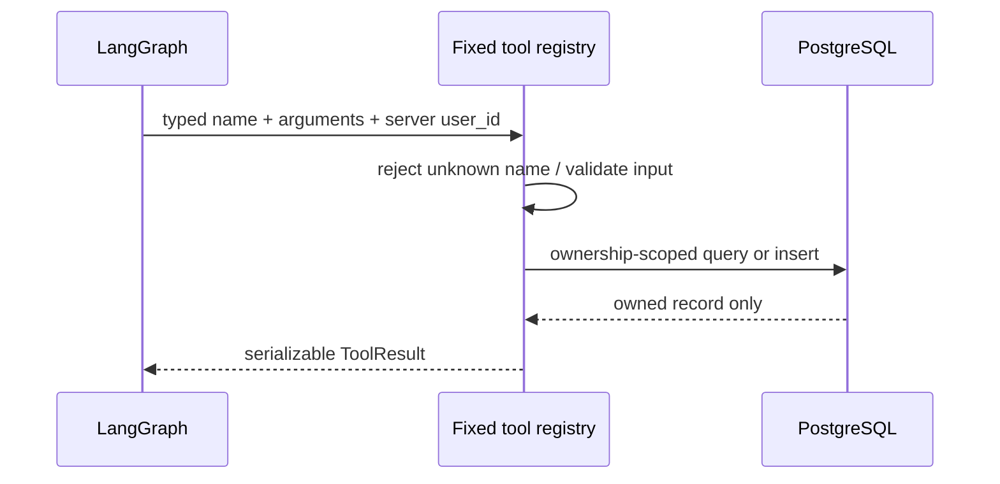

# SupportAI Agent Platform

SupportAI is a portfolio-grade customer-support workspace that combines authenticated chat, document-grounded answers, safe account tools, persistent history, and asynchronous PDF indexing. It is intentionally a modular monolith: easy to run locally and explain in an interview, while retaining production-minded boundaries around identity, untrusted content, retries, observability, and external AI calls.

## Feature tour

- Register or sign in with Argon2-hashed credentials and short-lived JWT access tokens.
- Stream assistant stages, tokens, citations, completion, and safe error events over SSE.
- Upload PDF knowledge documents and watch Celery move them from queued to processing to ready.
- Ground knowledge answers in pgvector similarity search with source/page citations.
- Check an owned order, view the authenticated profile, or create a support ticket through three allow-listed tools.
- Resume private conversation history from a responsive React dashboard.
- Trace requests with request IDs, structured JSON logs, safe execution metadata, readiness probes, and Redis-backed limits.

## Architecture



The API and worker share one Python codebase. PostgreSQL is the source of truth, Redis is the Celery broker and rate-limit store, and the provider gateway is the only module that speaks to Gemini.

### PDF-to-vector RAG



### Agent routing



### Safe tool calling



The model cannot select arbitrary Python functions. Profile identity always comes from the verified JWT context; order lookup includes the user ID in the query; and ticket content is length-validated.

## Prerequisites

- Docker Desktop with Compose v2
- A Google Gemini API key
- Optional local development: Python 3.12 and Node.js 22

## Environment

Copy `.env.example` to `.env`, replace the development secrets, and add your Gemini key. The local `.env` is ignored by Git.

| Variable | Purpose | Development default |
|---|---|---|
| `APP_ENV` | `development`, `test`, or `production` behavior | `development` |
| `DATABASE_URL` | SQLAlchemy async PostgreSQL URL | Compose PostgreSQL |
| `REDIS_URL` | Celery and rate-limit Redis URL | Compose Redis |
| `JWT_SECRET` | JWT signing secret; use 32+ random bytes | change this |
| `JWT_ALGORITHM` | Token signature algorithm | `HS256` |
| `JWT_ACCESS_TOKEN_MINUTES` | Access-token lifetime | `30` |
| `GEMINI_API_KEY` | Required for normal AI operation | none |
| `GEMINI_CHAT_MODEL` | Intent and answer model | `gemini-2.5-flash` |
| `GEMINI_EMBEDDING_MODEL` | 768-dimensional embedding model | `gemini-embedding-001` |
| `CORS_ORIGINS` | JSON array of allowed browser origins | localhost:5173 |
| `UPLOAD_DIR` | Worker-visible PDF storage | `/app/uploads` |
| `MAX_UPLOAD_BYTES` | Server/client PDF limit | `10485760` |
| `RETRIEVAL_TOP_K` | Maximum retrieved chunks | `5` |
| `AUTH_RATE_LIMIT` | Auth requests per window/client | `10` |
| `CHAT_RATE_LIMIT` | Chat requests per window/client | `30` |
| `UPLOAD_RATE_LIMIT` | Uploads per window/client | `10` |
| `RATE_LIMIT_WINDOW_SECONDS` | Redis counter window | `60` |
| `VITE_API_URL` | Browser API base URL | `http://localhost:8000/api/v1` |

Generate a production secret with a password manager or `python -c "import secrets; print(secrets.token_urlsafe(48))"`. Never commit `.env`.

## Quick start

```bash
cp .env.example .env
# Edit .env and set GEMINI_API_KEY and JWT_SECRET.
docker compose up -d postgres redis
docker compose run --rm api alembic upgrade head
docker compose run --rm api python -m app.scripts.seed
docker compose up --build api worker frontend
```

Open `http://localhost:5173`. The development seed account is `demo@supportai.local` / `DemoPass123!`; change or remove it outside local development.

Useful operations:

```bash
docker compose ps
docker compose logs -f api worker
docker compose down
docker compose down -v   # also removes local database/Redis volumes
```

The final command is destructive and is only appropriate when you intentionally want a clean local database.

## Migrations and seed data

```bash
docker compose run --rm api alembic upgrade head
docker compose run --rm api python -m app.scripts.seed
```

The seed is idempotent, development-only, and creates two orders (`ORD-1001`, `ORD-1002`) owned by the demo user.

## Tests and builds

With Compose:

```bash
docker compose run --rm api python -m pytest -q
docker compose run --rm frontend npm test -- --run
docker compose run --rm frontend npm run build
```

Locally:

```bash
cd backend
python -m pip install -e '.[test]'
python -m pytest -q

cd ../frontend
npm install
npm test -- --run
npm run typecheck
npm run build
```

Tests use deterministic provider fakes. Normal application operation does not silently replace Gemini.

## API and SSE examples

Register:

```bash
curl -s http://localhost:8000/api/v1/auth/register \
  -H 'Content-Type: application/json' \
  -d '{"email":"person@example.com","name":"Person","password":"Stronger123!"}'
```

Upload a PDF:

```bash
curl -s http://localhost:8000/api/v1/documents/upload \
  -H "Authorization: Bearer $TOKEN" \
  -F 'file=@policy.pdf;type=application/pdf'
```

Stream chat:

```bash
curl -N http://localhost:8000/api/v1/chat/message \
  -H "Authorization: Bearer $TOKEN" \
  -H 'Content-Type: application/json' \
  -d '{"content":"What is the refund policy?"}'
```

SSE frames use this stable shape:

```text
event: stage
data: {"name":"retrieving","retrieval_count":3}

event: citation
data: {"source":"refund-policy.pdf","page":2,"chunk_id":"..."}

event: token
data: {"text":"Refunds "}

event: complete
data: {"conversation_id":"...","message":"Refunds take five business days."}
```

On a provider failure the stream terminates with one `error` event, and no partial assistant message is persisted.

## Security decisions

- Passwords use Argon2; JWTs are short-lived and contain a typed user UUID.
- Conversation, message, order, and ticket access is ownership-scoped in database queries.
- PDF extension, MIME type, signature, and streamed byte size are all checked before indexing. Storage names are UUIDs and paths are never returned by the API.
- Retrieved PDF text is serialized as reference data while policy is sent through Gemini's `system_instruction`. This materially reduces prompt-injection risk; model output is still untrusted and important account details should be verified.
- The tool registry has exactly three names and never trusts a model-supplied user ID.
- Error bodies and logs omit provider details, credentials, prompts, authorization headers, cookies, and filesystem paths.
- Redis keys separate auth, chat, and upload limits. Rate-limit responses include `Retry-After`.
- Request IDs are accepted only in a restricted format or replaced with generated UUIDs.

## Troubleshooting

- **Docker Desktop closes while initializing inference:** install the current Docker Desktop update, quit it fully, and start it again. SupportAI uses Gemini over the official SDK and does not require Docker's local inference manager.
- **`GEMINI_API_KEY is required`:** put a real key in the root `.env`, then recreate `api` and `worker` with `docker compose up -d --force-recreate api worker`.
- **Document remains pending:** check `docker compose logs worker`, confirm Redis is healthy, and verify the API and worker share the `uploads` volume.
- **Document fails with no readable text:** use a text-based PDF. Scanned image-only PDFs need OCR, which is outside this release.
- **Readiness is 503:** inspect `GET /health/ready`, then check PostgreSQL and Redis with `docker compose ps`.
- **Frontend receives CORS errors:** add the exact browser origin to `CORS_ORIGINS` as a JSON array and restart the API.
- **Reset local state:** `docker compose down -v`, then rerun migrations and seed. This deletes local project data.

## Five-minute interview narrative

### How I built it

I started from the trust boundaries: authenticated identity, private conversations, shared knowledge documents, and a very narrow AI provider interface. The FastAPI application owns HTTP and persistence use cases; LangGraph coordinates typed branches but never opens its own database sessions; the Celery worker owns extraction and indexing. I used tests at each boundary—auth, ownership, prompt injection, tools, graph branches, SSE persistence, upload validation, rate limiting, and frontend streaming—then added one journey that crosses registration, PDF processing, retrieval, and cited chat.

### Why RAG

Company policy changes more often than application code and should remain inspectable. RAG lets staff upload source documents, retrieves only relevant chunks, and gives the user citations. The prompt treats retrieval as untrusted evidence, so a malicious sentence in a PDF cannot become an instruction. Empty documents fail clearly, embedding calls are bounded, and reprocessing atomically replaces old chunks.

### Why LangGraph

The product has three explicit paths: knowledge retrieval, a safe business tool, or a direct conversational answer. LangGraph makes those transitions visible and testable, while typed state carries messages, citations, tool output, answer text, and user-visible events. This is more maintainable than hiding routing in one large prompt and less complex than a multi-agent system.

### How tool calling works

Gemini returns a typed intent with one of three literal tool names and string arguments. A fixed registry validates those arguments with Pydantic and injects the authenticated user UUID from server context. Order and profile reads are scoped by that UUID; ticket writes use it directly. Unknown names, invalid arguments, and foreign orders fail without revealing whether another customer's record exists.

### How I would scale it

The API and worker are stateless apart from shared services, so the first step is multiple replicas behind a load balancer and separately scaled worker queues. I would move PDFs to object storage, use managed PostgreSQL/pgvector and Redis, add connection pooling, and introduce tenant IDs plus roles. At larger retrieval volume I would tune vector indexes, cache safe query embeddings/results, separate ingestion priorities, and measure provider latency and retrieval quality before splitting the modular monolith.

## Project layout

```text
backend/app/api       FastAPI routes and dependencies
backend/app/agent     LangGraph state, nodes, and graph
backend/app/ai        Gemini gateway and prompt boundaries
backend/app/rag       PDF extraction, chunking, indexing, retrieval
backend/app/tools     Typed fixed tool registry
backend/app/workers   Celery application and document task
frontend/src          React auth, chat, history, and documents UI
```
